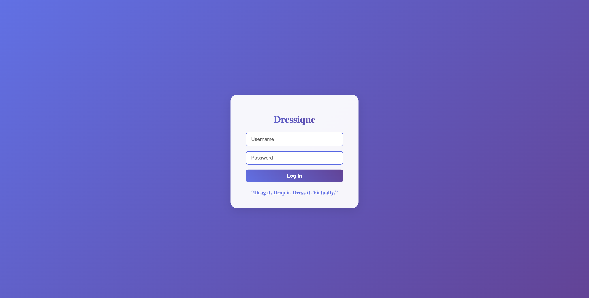
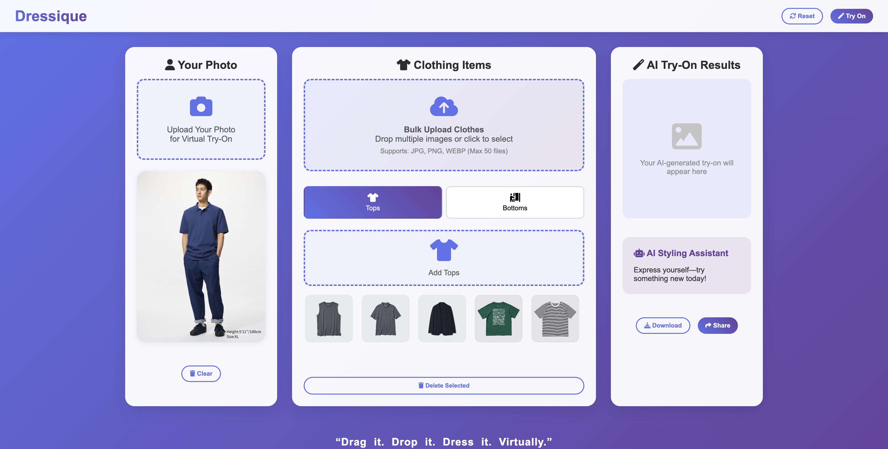

# Dressique 虛擬試穿系統設計文件與使用說明

## 系統概述

Dressique 是一個基於 AI 的虛擬試穿應用程式，允許使用者上傳個人照片和服裝，並透過 AI 技術生成虛擬試穿效果。系統採用前後端分離架構，提供直觀的拖放介面和完整的服裝管理功能。

## 展示影片

[](https://youtu.be/L4n3UHg-Rd4)

## 系統介面

#### 登入/註冊



#### 主頁面



---

## 系統架構設計

### 1. 前端架構

#### 核心模組
- **身份驗證模組**：處理使用者登入、註冊和會話管理
- **檔案上傳模組**：處理使用者照片和服裝照片上傳
- **服裝管理模組**：分類管理上衣和下裝
- **AI 試穿模組**：與後端 API 交互進行試穿生成
- **結果展示模組**：展示和管理試穿結果
- **品牌化分享模組**：添加品牌標識並支援分享功能

#### 技術特性
- 響應式設計，支援拖放操作
- 批量上傳功能，最多支援 50 個檔案
- 即時預覽和選擇介面
- Canvas 圖像處理用於品牌化輸出

### 2. 後端 API 架構

#### 主要 API 端點
```
# 身份驗證相關
POST /api/login/                     # 使用者登入
POST /api/logout/                    # 使用者登出
POST /api/register/                  # 使用者註冊
GET /api/auth/status                 # 檢查登入狀態

# 使用者照片管理
POST /api/user-photo/upload          # 上傳使用者照片
DELETE /api/user-photo/              # 刪除使用者照片
GET /api/user-photo/                 # 獲取使用者照片

# 服裝管理
POST /api/user-clothes/upload        # 上傳單個服裝
POST /api/user-clothes/bulk-upload   # 批量上傳服裝
GET /api/user-clothes/               # 獲取使用者服裝列表
DELETE /api/user-clothes/{id}        # 刪除特定服裝

# AI 試穿功能
POST /api/try-on/                    # 生成試穿結果
GET /api/try-on/                     # 獲取試穿結果列表
DELETE /api/try-on/{id}              # 刪除試穿結果

# 檔案存取
GET /api/s3/presigned-url            # 獲取 S3 預簽名 URL
GET /api/s3/proxy/{filepath}         # S3 代理存取
```

### 3. 資料結構

#### 全域狀態管理
```javascript
selectedClothes = {
    tops: [],      // 上衣陣列
    bottoms: [],   // 下裝陣列
    user: null     // 使用者照片 URL
}

// 試穿結果管理
tryOnResults = [
    {
        try_on_id: number,
        image_url: string,
        comments: string
    }
]
```

#### 服裝項目結構
```javascript
clothingItem = {
    id: number,        // 後端分配的 ID
    src: string,       // 圖片 URL
    name: string,      // 顯示名稱
    category: string   // 'tops' 或 'bottoms'
}
```

---

## 功能模組詳細設計

### 1. 身份驗證系統

#### 註冊流程
1. **表單驗證**：檢查使用者名稱和密碼是否為空
2. **API 調用**：發送註冊請求到 `/api/register/`
3. **響應處理**：
   - 成功：重定向到試穿頁面 (`/login`)
   - 失敗：顯示錯誤訊息
4. **錯誤處理**：網路錯誤、伺服器錯誤的友善提示
   
#### 登入流程
1. **表單驗證**：檢查使用者名稱和密碼是否為空
2. **API 調用**：發送登入請求到 `/api/login/`
3. **響應處理**：
   - 成功：重定向到試穿頁面 (`/try-on`)
   - 失敗：顯示錯誤訊息
4. **錯誤處理**：網路錯誤、伺服器錯誤的友善提示

#### 登入表單處理
```javascript
// 登入表單事件處理
document.getElementById('loginForm').addEventListener('submit', async function(e) {
    e.preventDefault();
    
    // 表單驗證
    const username = this.username.value.trim();
    const password = this.password.value.trim();
    
    if (!username || !password) {
        showError("Please enter both username and password.");
        return;
    }
    
    // API 調用和響應處理
    try {
        const response = await fetch('/api/login/', {
            method: 'POST',
            headers: { 'Content-Type': 'application/json' },
            body: JSON.stringify({ username, password })
        });
        
        const data = await response.json();
        if (data.success) {
            window.location.href = '/try-on';  // 重定向到主功能頁面
        } else {
            showError(data.message || "Login failed.");
        }
    } catch (error) {
        showError("Server error. Please try again.");
    }
});
```

#### 會話管理
- 使用 Session 維護登入狀態

### 2. 檔案上傳系統

#### 支援的上傳方式
- **點擊上傳**：點擊上傳區域選擇檔案
- **拖放上傳**：直接拖拽圖片到上傳區域
- **批量上傳**：一次上傳多個服裝圖片

#### 上傳處理流程
1. 檔案驗證（圖片格式檢查）
2. 前端預覽生成
3. FormData 封裝
4. 後端 API 調用
5. 響應處理和 UI 更新

### 2. 服裝分類管理

#### 分類系統
- **上衣 (Tops)**：襯衫、T恤、外套等
- **下裝 (Bottoms)**：褲子、裙子等

#### 管理功能
- 分類切換和計數更新
- 項目選擇（每類最多選一個）
- 跨分類移動
- 批量刪除

### 3. AI 試穿引擎

#### 試穿生成流程
1. 驗證必要條件（使用者照片 + 至少一件服裝）
2. 收集選中的上衣和下裝 ID
3. 調用後端 AI API
4. 顯示載入動畫
5. 處理結果和評論

#### 結果管理
- 縮圖畫廊展示
- 點擊切換查看
- 個別刪除功能
- AI 評論顯示

### 4. 品牌化和分享

#### 品牌化處理
- 高解析度 Canvas 繪製（2x 縮放）
- 品牌標識和主題色彩
- 圓角邊框設計
- AI 評論嵌入

#### 分享功能
- 原生分享 API 支援
- 剪貼簿複製備用方案
- 品牌化圖片下載

---

## 使用說明

### 快速開始

#### 前置步驟：使用者註冊
1. 開啟 Dressique 應用程式
2. 在登入/註冊頁面輸入想要註冊的使用者名稱和密碼
3. 點擊「登入」按鈕
4. 註冊成功後將自動重定向到試穿功能頁面
   
#### 前置步驟：使用者登入
1. 開啟 Dressique 應用程式
2. 在登入/註冊頁面輸入使用者名稱和密碼
3. 點擊「登入」按鈕
4. 登入成功後將自動重定向到試穿功能頁面

#### 步驟 1：上傳個人照片
1. 點擊左上角「上傳您的照片」區域
2. 選擇清晰的全身照片
3. 等待上傳完成，照片將顯示在預覽區

#### 步驟 2：上傳服裝
1. 點擊「上衣」或「下裝」標籤切換分類
2. 點擊對應的上傳區域或直接拖拽圖片
3. 支援單個上傳或批量上傳（最多 50 張）

#### 步驟 3：選擇試穿組合
1. 在服裝網格中點擊想要試穿的上衣
2. 切換到下裝分類，選擇想要的下裝
3. 每個分類只能選擇一個項目

#### 步驟 4：生成試穿效果
1. 點擊「生成 AI 試穿」按鈕
2. 等待 AI 處理（顯示載入動畫）
3. 查看右側生成的試穿結果和 AI 評論

#### 步驟 5：管理結果
1. 在結果區域下方查看歷史試穿縮圖
2. 點擊縮圖切換查看不同結果
3. 使用「下載」或「分享」功能保存結果
4. 點擊縮圖上的 ✕ 刪除不需要的結果

### 進階功能

#### 批量上傳
1. 切換到想要的服裝分類
2. 點擊「批量上傳」區域
3. 選擇多個圖片檔案（最多 50 個）
4. 查看上傳進度條
5. 所有圖片將自動分類到當前選中的類別

#### 服裝管理
- **移動分類**：長按服裝項目可移動到其他分類
- **批量刪除**：選中多個項目後使用刪除功能
- **重命名**：上傳時的檔案名稱會作為預設名稱

#### 重置功能
- 點擊「重置所有」清除所有上傳的內容
- 包括使用者照片、所有服裝和試穿結果
- 操作不可撤銷，請謹慎使用

### 技術要求

#### 瀏覽器支援
- Chrome 80+
- Firefox 75+
- Safari 13+
- Edge 80+

#### 檔案格式
- 支援：JPG、PNG、WebP
- 建議解析度：800x600 以上
- 單檔大小：建議小於 5MB

#### 網路要求
- 穩定的網際網路連接
- 上傳速度：建議 1Mbps 以上
- AI 處理需要 10-30 秒

### 常見問題

#### Q1：為什麼試穿效果不理想？
- 確保使用者照片清晰且為全身照
- 服裝圖片背景儘量簡潔
- 避免複雜的姿勢或遮擋

#### Q2：上傳失敗怎麼辦？
- 檢查網路連接
- 確認檔案格式正確
- 重新整理頁面後重試

#### Q3：如何獲得最佳試穿效果？
- 使用高品質的正面全身照
- 服裝圖片最好是平鋪或模特展示
- 確保光線充足，避免陰影

#### Q5：忘記密碼怎麼辦？
- 聯繫系統管理員重設密碼

#### Q6：登入後頁面沒有反應？
- 檢查瀏覽器是否阻擋了重定向
- 清除瀏覽器快取後重試
- 確認登入憑證是否正確

#### Q7：可以保存多少個試穿結果？
- 系統會保存所有生成的試穿結果
- 可透過縮圖畫廊查看歷史記錄
- 不需要的結果可以個別刪除

#### Q8：為什麼無法使用試穿功能？
- 同時有過多使用者在使用該功能

---

## 系統維護

### 效能優化
- 圖片壓縮和快取
- 非同步載入和懶載入
- API 請求優化

### 安全考量
- 檔案類型驗證
- 檔案大小限制
- 使用者資料隔離
- 會話管理和逾時機制
- 密碼安全策略
- CSRF 和 XSS 防護

### 擴展性
- 模組化設計便於功能擴展
- API 版本管理
- 資料庫結構可擴展

---

## Low Fidelity Wireframe


## API 文件

- 🧾 [OpenAPI YAML 原始檔案](./docs/openapi.yaml)
- 🔍 [查看渲染後的 OpenAPI 文件（Redoc）](https://BillyHsieh123a.github.io/SAD_NEW/)

*Dressique - Drag it, Drop it, Dress it*

## Unit Test

我們使用 **Jest** 作為 JavaScript 測試框架，搭配 **jsdom** 模擬瀏覽器環境，建立完整的自動化測試體系。

### 測試檔案結構
```
__tests__/
├── login.test.js     # 登入功能測試
└── try_on.test.js    # 試穿功能測試
```

### 登入功能測試
**表單驗證**：測試用戶名/密碼為空、空白字符等情況的錯誤處理。  
**成功登入**：驗證 API 呼叫參數正確性、空白字符修剪、錯誤訊息隱藏。  
**登入失敗**：測試伺服器錯誤訊息和預設錯誤處理。  
**網路錯誤**：涵蓋連線錯誤和 JSON 解析錯誤。  
**UI 行為**：確保表單提交時的正確 UI 反應。

### 試穿功能測試
**初始狀態**：檢查 DOM 元素載入和初始 UI 狀態。  
**衣服選擇**：測試點擊事件、選中狀態切換、視覺回饋。  
**試穿功能**：驗證按鈕啟用邏輯、結果顯示、圖片載入。  
**錯誤處理**：測試無選擇提示、API 錯誤、網路問題的處理。

### GitHub Actions 自動化
每次 push 或 PR 到 main 分支時自動觸發，在 Node.js 18.x 和 20.x 環境下執行測試，包含程式碼檢出、環境設置、相依套件安裝、測試執行和覆蓋率報告產生。

### 執行指令
- `npm test`：執行所有測試
- `npm run test:watch`：監視模式
- `npm run test:coverage`：產生覆蓋率報告
- `npm run test:ci`：CI 環境執行

這套測試系統提供自動化、全面性的測試覆蓋，確保每次程式碼變更都能快速獲得反饋，防止功能回歸，提升部署信心。